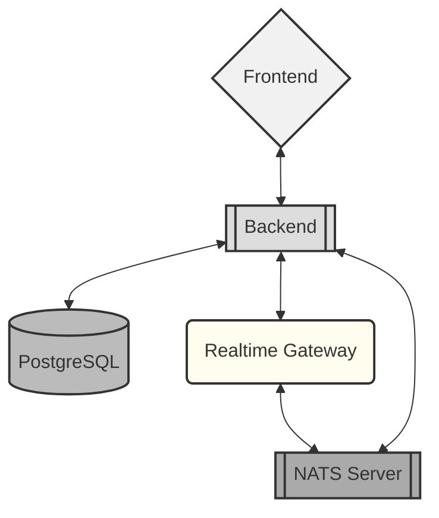

#  Daily Set Game

[](https://github.com/clxrityy/daily-set/actions/workflows/backend.yml)[](https://codecov.io/gh/clxrityy/daily-set)

[](https://github.com/clxrityy/daily-set/actions/workflows/realtime.yml)[](https://codecov.io/gh/clxrityy/daily-set)

[](https://github.com/clxrityy/daily-set/actions/workflows/frontend.yml)[](https://codecov.io/gh/clxrityy/daily-set)

A web application for playing the card game "Set" online.

> https://daily-set.fly.dev/

## Usage

```bash
# Clone the repository
git clone https://github.com/clxrityy/daily-set.git
cd daily-set

# Run the application
make dev
# -> [ http://localhost:8000 ]

# Run tests
make test

# View all commands
make help
```

## Application Structure



<details>
<summary><strong>Read more</strong></summary>
<br />

- **Backend (Python)** - The main backend service is built with FastAPI and SQLModel, providing a RESTful API for the application. See [`app/README.md`](./app/README.md) for details.
- **Frontend (React)** - The client-side application is built with React and Vite, offering a responsive user interface for the game. See [`frontend/README.md`](./frontend/README.md) for details.
- **Realtime Gateway (Go)** - An optional Go WebSocket gateway lives under `realtime/`. It bridges clients to backend events via NATS and is designed for horizontal scalability. See [`realtime/README.md`](./realtime/README.md) for details.
- **NATS Server (with JetStream)** - A lightweight, high-performance messaging system used for real-time communication between services. A minimal Fly app config to run a private NATS server with JetStream is provided under `nats/`. See [`nats/README.md`](./nats/README.md) for details.
- **ZAP Baseline Scan** - A GitHub Actions workflow for automated security scanning of the backend using OWASP ZAP. It helps identify common security vulnerabilities. See [`.zap/README.md`](./.zap/README.md) for details.
- **`Fly.io` Deployment** - The app is deployed on Fly.io for easy global access. See [`fly.toml`](./fly.toml) and the `Makefile` for deployment commands and configuration.

</details>
